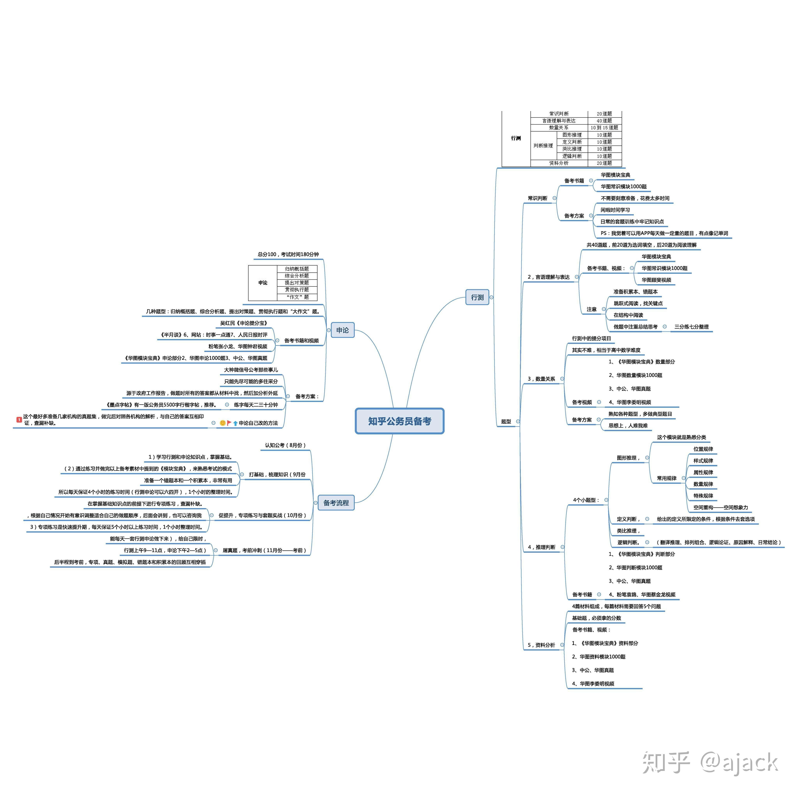

####	tips：直接在你github地址中的html文件前面加上`http://htmlpreview.github.com/?`可实现html在线预览

行测时长分配参考

复习计划参考

**[笑与君歌十二笙行测&申论笔记](https://pan.baidu.com/s/1BZ1zkXrRPMrbSkr6tc-mHw)密码:4mii**

###	别人总结的知识导图（粉笔系，仅供参考）

