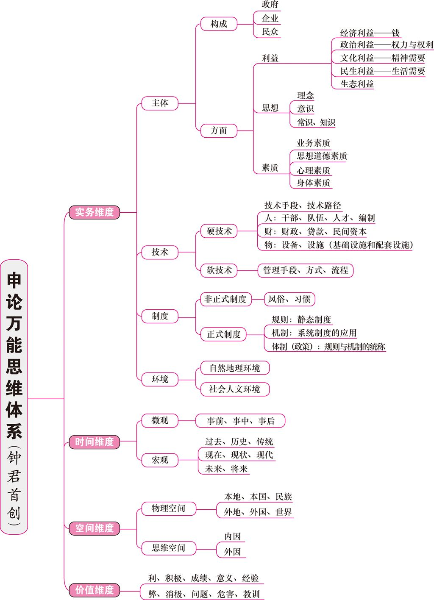

万能思维体系

##	第一章	申论之道

##	第二章

##	第三章

##	第四章

##	第五章——解决问题的独特技巧

###	根据问题找原因

* 方法：辩证思维分析

  * 从客观实际出发
  * 用发展的眼光看问题
  * 用普遍联系的眼光看事物

* 步骤

  * 根据材料找到特定社会现象的消极、负面影响
  * 找存在问题的原因

* 解题思路（参照第四章原因分析题）

  * 根本技巧：揭示不同事实之间的内在联系

    * 分析过往性原因，即现在为什么会这样

      > ​	界定问题类型
      >
      >  	1.	宏观问题，从政治、经济、文化、社会、生态五个角度进行分析
      >       	1.	政治：权力和权利。即政府公权力和民众私权利
      >       	2.	经济：金钱及市场
      >       	3.	文化：价值观、载体（物质的或非物质的）、制度。核心是精神、思想、价值观
      >  	2.	微观问题，借助万能思维体系的实务维度（即主体、技术、制度、环境），利益、思想、素质、制度、技术是分析微观具体问题最常用的五个点

    * 分析未来星原因，即将来为什么要那样

      > ​	阐述必要性
      >
      > 1. 现在问题的严重性，即要解决这个问题的必要性和迫切性
      > 2. 解决这个问题的有利形势和条件，即可行性
      > 3. 解决这个问题的重要性，即解决此类问题将带来哪些好处，有哪些重要意义

* 万能八条

  1. 领导重视，提高认识
  2. 加强宣传，营造氛围
  3. 教育培训，提高素质
  4. 健全政策法规，完善制度
  5. 组织协调，形成机制
  6. 增加投入，依靠技术
  7. 依法监督，全面落实
  8. 总结反思，借鉴经验

##	第六章

